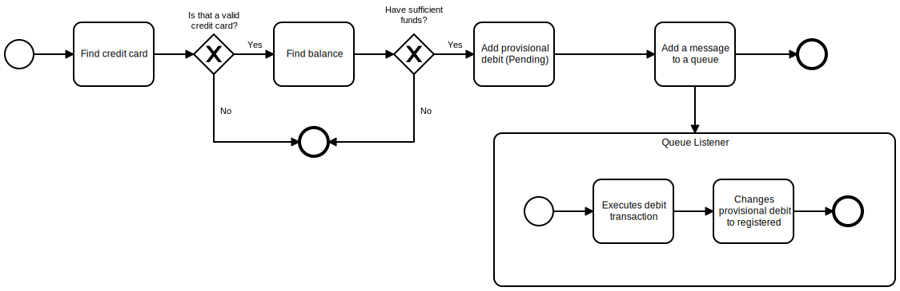

# Debit authorizer

This project is about an example of a debit authorizer with the credit card using functions over the IBM Cloud Functions.

## Why?

Create a highly available, auto scalable and highly performant solution to authorize debit operations for financial institutions.
## How it works

Below is the diagram that shows how the system will work.



## How it was developed

* Functions
* Serverless framework
* IBM Functions Composer
* Java
* NodeJS
* PostgreSQL

### Have you set up your account credentials?

Before you can deploy your service to OpenWhisk, you need to have an account registered with the platform.

- *Want to run the platform locally?* Please read the project's [*Quick Start*](https://github.com/openwhisk/openwhisk#quick-start) guide for deploying it locally.
- *Want to use a hosted provider?* Please sign up for an account with [IBM Bluemix](https://console.ng.bluemix.net/) and then follow the instructions for getting access to [OpenWhisk on Bluemix](https://console.ng.bluemix.net/openwhisk/). 

Account credentials for OpenWhisk can be provided through a configuration file or environment variables. This plugin requires the API endpoint, namespace and authentication credentials.

**Do you want to use a configuration file for storing these values?** Please [follow the instructions](https://console.ng.bluemix.net/openwhisk/cli) for setting up the OpenWhisk command-line utility. This tool stores account credentials in the `.wskprops` file in the user's home directory. The plugin automatically extracts credentials from this file at runtime.  No further configuration is needed.

**Do you want to use environment variables for credentials?** Use the following environment variables to be pass in account credentials. These values override anything extracted from the configuration file.

- *OW_APIHOST* - Platform endpoint, e.g. `openwhisk.ng.bluemix.net`
- *OW_AUTH* - Authentication key, e.g. `xxxxxx:yyyyy

### Have you installed the provider plugin?

Install project dependencies which includes the OpenWhisk provider plugin.

```shell
npm install
```

**_…and that's it!_**

### Deploy Service

Use the `serverless` command to deploy your service. The sample `handler.js` file can be deployed without modification.

```shell
mvn clean deploy
deploy credit-card-online-debit-dev-authorizer authorizer.json -w
```